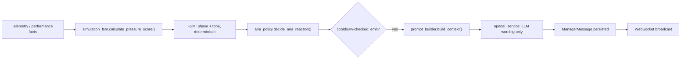
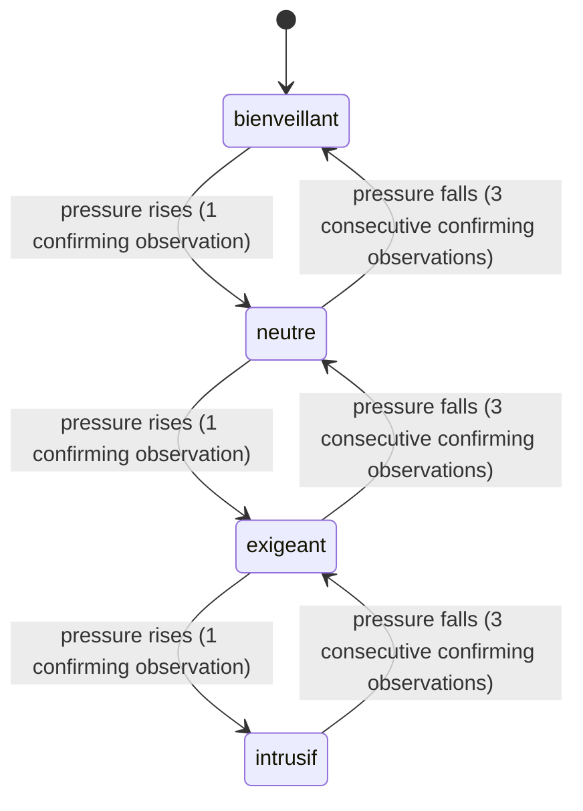

# ARIA Architecture — AI Work Supervisor

**ARIA = AI Work Supervisor.** ARIA is the system's adaptive simulation-supervision component: it observes telemetry, decides a supervision tone deterministically, and generates short natural-language messages reacting to what has already happened. It does not decide what happens.

## Architecture



## Pressure score (`simulation_fsm.calculate_pressure_score`)

```python
pressure = Σ(component × weight) / Σ(weight)
weights = {
    "error_rate": 0.30,
    "response_time_deviation": 0.20,
    "inactivity": 0.15,
    "remaining_time": 0.20,
    "reconsiderations": 0.15,
}
```
- `error_rate` component: `error_rate × 100`.
- `response_time_deviation`: percentage slowdown of the recent response time vs. the lifetime average, capped at 0–100 (0 if either time is unavailable).
- `inactivity`: `idle_time_seconds / 120 × 100`, capped at 100.
- `remaining_time`: `(1 − remaining_time_ratio) × 100`, 0 if no active task has a real deadline.
- `reconsiderations`: `reconsideration_rate × 100`.

## Tone bands

```
[0, 25)   → bienveillant
[25, 50)  → neutre
[50, 75)  → exigeant
[75, 101) → intrusif
```

**Conceptual English equivalents** (used only for explanatory purposes; the code terminology below is authoritative and is never renamed): `bienveillant` ≈ Supportive, `neutre` ≈ Neutral, `exigeant` ≈ Demanding, `intrusif` ≈ Intrusive.

## Hysteresis

- A rolling window of the last `PRESSURE_HISTORY_WINDOW = 5` raw pressure-band votes is kept (`Session.pressure_history`).
- **Increasing** pressure requires only `CONSECUTIVE_OBSERVATIONS_TO_INCREASE = 1` agreeing observation to move the tone up.
- **Decreasing** pressure requires `CONSECUTIVE_OBSERVATIONS_TO_DECREASE = 3` consecutive agreeing observations before the tone is allowed to move down.

This produces realistic escalation behavior (quick to raise supervision, slow to relax it) rather than oscillation on every single event.

## Phase transitions (`SessionPhase`, actual enum values)

`accueil → montee_pression → pic_charge → debriefing` (conceptually: Welcome → Pressure Ramp → Peak Load → Debriefing).

- `accueil → montee_pression`: after `WELCOME_MIN_SECONDS = 60` elapsed **or** `WELCOME_MIN_TASKS = 1` task completed (whichever first).
- `montee_pression → pic_charge`: when `pressure_score ≥ PEAK_LOAD_PRESSURE_THRESHOLD = 55` **or** `remaining_time_ratio ≤ PEAK_LOAD_REMAINING_TIME_RATIO = 0.25`.
- `pic_charge → debriefing`: **never automatic** — only set explicitly, either by `POST /sessions/{id}/end` or by the sequential task engine when the sequence completes or the global timer expires. The FSM's own `_next_phase` function never returns `debriefing` on its own.

## Phase tone floors

Each phase enforces a minimum tone the FSM will never go below regardless of the raw pressure score: `accueil → bienveillant`, `montee_pression → neutre`, `pic_charge → exigeant`, `debriefing → bienveillant`. The FSM can go *above* the floor (e.g. `intrusif` during `montee_pression` is possible), never below it.

## ARIA finite-state machine (tone track)



## Trigger policy (`aria_policy.decide_aria_reaction`)

Actual triggers implemented: `TASK_STARTED`, `TASK_COMPLETED`, `NEW_TASK_REQUIRED`, `PHASE_TRANSITION`, `LOW_REMAINING_TIME`, `RECONSIDERATION`, `MULTIPLE_RECONSIDERATIONS`, `FAST_DECISION`, `SLOW_DECISION`, `MULTIPLE_ERRORS`, `ERROR_DETECTED`, `HIGH_ACCURACY`, `LOW_ACCURACY`, `HIGH_IDLE_TIME`, `STRESS_INCREASE`, `SLOW_PROGRESS`.

When multiple triggers fire in the same evaluation pass, the highest-severity one wins.

## Frequency, cooldown, and critical bypass

| Tone | Minimum seconds between proactive messages | Same-trigger repeat cooldown |
|---|---|---|
| `bienveillant` | 45 | 90 |
| `neutre` | 30 | 60 |
| `exigeant` | 20 | 40 |
| `intrusif` | 10 | 20 |

A trigger with `severity ≥ 4` (the `CRITICAL_SEVERITY_BYPASS` threshold) bypasses both the minimum-gap and same-trigger cooldown entirely — used for genuinely time-critical events (e.g. very low remaining time, task completion).

## Authority boundaries — verified

- **Stress does not directly force `intrusif` tone.** `STRESS_INCREASE` is one candidate trigger among several (severity 3); the tone it is worded with is always the FSM's already-computed `manager_tone`, itself derived from the five-component weighted pressure score — stress affects that score only indirectly (via its contribution to the `reconsiderations`/behavioral signals it correlates with), never as a direct override.
- **Behavioral evaluation does not control ARIA.** `behavioral_evaluation.py` has no import path into `simulation_fsm.py` or `aria_policy.py`, and only runs after the session ends.
- **ARIA state is backend-authoritative.** The FSM computes phase and tone from `ExtendedPerformanceMetrics` alone; no other module writes to `Session.current_phase` or `Session.current_manager_tone` outside the FSM's own `evaluate_and_persist` and the explicit `/end` transition.
- **The LLM does not determine ARIA state.** `decide_aria_reaction(facts, manager_tone)` takes the FSM's tone as an input; the OpenAI call happens strictly afterward and only ever returns wording (see `openai-integration.md`).
