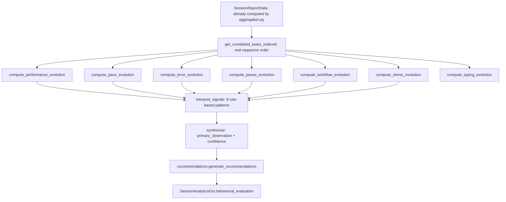

# Behavioral Evaluation Architecture

Source: `backend/app/reports/behavioral_evaluation.py`. This is an additive analytical layer — it reads outputs already computed by `aggregation.py` and adds no new raw data collection.

## Pipeline



## Early/late split method

Every evolution metric that requires an early-vs-late comparison uses the **same** function, `split_half(items)`:
```python
mid = (len(items) + 1) // 2
return items[:mid], items[mid:]
```
The first half receives the extra item on an odd count. This single function is reused, unmodified, for completed tasks (performance, pace, errors, pauses, workflow) and for `StressDeclaration` rows and typing-metric rows — there is no second, incompatible split algorithm anywhere in the codebase.

## The seven evolution categories

| Category | Early/late input | Classification labels |
|---|---|---|
| Performance | `avg_score_first_half` / `_second_half` (reused from `aggregation.py`, not recomputed) | `IMPROVING`, `STABLE`, `DECLINING`, `INSUFFICIENT_DATA` |
| Pace | per-task `pace_efficiency` samples | `ACCELERATING`, `STABLE`, `SLOWING`, `INSUFFICIENT_DATA` |
| Errors | mean `error_count` per task, per half | `INCREASING`, `STABLE`, `DECREASING`, `INSUFFICIENT_DATA` |
| Pauses | pause count ÷ completed tasks, per half, time-boundary split | `INCREASING`, `STABLE`, `DECREASING`, `INSUFFICIENT_DATA` |
| Workflow | mean transition time (`next.started_at − prev.completed_at`), per half | `ACCELERATING`, `STABLE`, `SLOWING`, `INSUFFICIENT_DATA` |
| Stress | mean declared stress, per half of declarations | `INCREASING`, `STABLE`, `DECREASING`, `INSUFFICIENT_DATA` |
| Typing | mean chars/sec and speed variation, per half of typing-metric rows | `INCREASING`, `STABLE`, `DECREASING`, or the whole category is `None` |

Each classification is produced by comparing the early/late change against a fixed "stable band" (a documented heuristic constant — see `docs/methodology/metrics-and-indicators.md`), never against a statistically derived threshold.

**Typing evolution is `None` (not a zeroed/fabricated result) whenever fewer than two `typing_metrics` rows exist for the session.** Under the current default sequence (exactly one `email_writing` task), this is the common case — typing evolution will not be available for most sessions run against the default sequence.

**Pause evolution boundary note**: the early/late boundary is the completion timestamp of the first half's last task. A single pause whose gap straddles that exact boundary can be under-counted rather than double-counted — a documented, conservative limitation, not an error condition.

## The eight behavioral signals

Source: `interpret_signals()`. All are evaluated independently — a session can match more than one at once.

| Code | Trigger condition | Required data | Interpretation | Limitation |
|---|---|---|---|---|
| `FAST_INACCURATE` | pace `ACCELERATING` AND (performance `DECLINING` OR errors `INCREASING`) | ≥2 completed tasks | Faster execution accompanied by reduced accuracy or more errors | Descriptive only; does not establish causality between speed and accuracy |
| `SLOW_ACCURATE` | pace `SLOWING` AND performance ∈ {`STABLE`,`IMPROVING`} AND errors ∈ {`STABLE`,`DECREASING`} | ≥2 tasks | Slower execution with maintained or improved accuracy | Same |
| `SLOW_INACCURATE` | pace `SLOWING` AND performance `DECLINING` AND errors `INCREASING` | ≥2 tasks | Performance deterioration accompanied by slower execution | Same |
| `FAST_ACCURATE` | pace `ACCELERATING` AND performance ∈ {`STABLE`,`IMPROVING`} AND errors ∈ {`STABLE`,`DECREASING`} | ≥2 tasks | Efficient execution pattern | Same |
| `STRESS_STABLE_PERFORMANCE` | stress `INCREASING` AND performance ∈ {`STABLE`,`IMPROVING`} | ≥2 stress declarations | Declared pressure rose without a comparable performance decline | Self-report, typically small sample (few declarations per session) |
| `STRESS_PERFORMANCE_DECLINE` | stress `INCREASING` AND performance `DECLINING` | ≥2 declarations | Declared pressure rose alongside a performance decline | Correlational only, not a causal claim |
| `PAUSES_HIGH_ACCURACY` | pauses `INCREASING` AND `avg_score_overall ≥ 80` | ≥2 tasks | Longer/interrupted workflow while accuracy stayed high | The 80-point threshold is an absolute heuristic, not derived statistically |
| `ERRORS_NORMAL_PACE` | errors `INCREASING` AND pace `STABLE` | ≥2 tasks | Error frequency increased without a comparable pace change | Same |

None of these codes, titles, or descriptions use medical, psychological, or diagnostic vocabulary — verified by an automated test asserting the absence of terms such as "anxieux," "burnout," "épuisement," "diagnostic," "trouble," "personnalité" from every generated observation.

## Synthesis

If one or more signals fire, `synthesize()` selects exactly one as `primary_observation`, by a fixed, documented priority order:

```
SLOW_INACCURATE
> STRESS_PERFORMANCE_DECLINE
> FAST_INACCURATE
> ERRORS_NORMAL_PACE
> SLOW_ACCURATE
> PAUSES_HIGH_ACCURACY
> FAST_ACCURATE
> STRESS_STABLE_PERFORMANCE
```

This order ranks quality/accuracy-concerning combinations above purely positive or neutral ones — a documented design choice for surfacing the most actionable observation first, not a claim that any pattern is more "true" than another.

**Fallback**: if no signal fired, `primary_observation` is derived directly from `performance.evolution` alone (`PERFORMANCE_DECLINE` / `PERFORMANCE_IMPROVEMENT` / `STABLE_PERFORMANCE`), or `None` if performance itself is `INSUFFICIENT_DATA` — never fabricated.

## Confidence

```python
if total_tasks_completed < 2: return "INSUFFICIENT_DATA"
if total_tasks_completed < 4: return "LOW"
if total_tasks_completed < 6: return "MODERATE"
return "HIGH"
```

**"Confidence" here means evidence coverage — how many completed tasks the early/late splits are drawn from — not a statistical confidence interval and not a probability.** No inferential statistics (hypothesis tests, p-values, confidence intervals in the statistical sense) are computed anywhere in this module or in the wider codebase.

## Scope statement

The behavioral evaluation layer is **descriptive and deterministic**. It produces classification labels and rule-based observations from already-computed derived metrics. It is not, and does not claim to be, a medical or psychological diagnostic system, and it has no code path that reads from or writes to ARIA's state (see `runtime-architecture.md`'s independence section).
