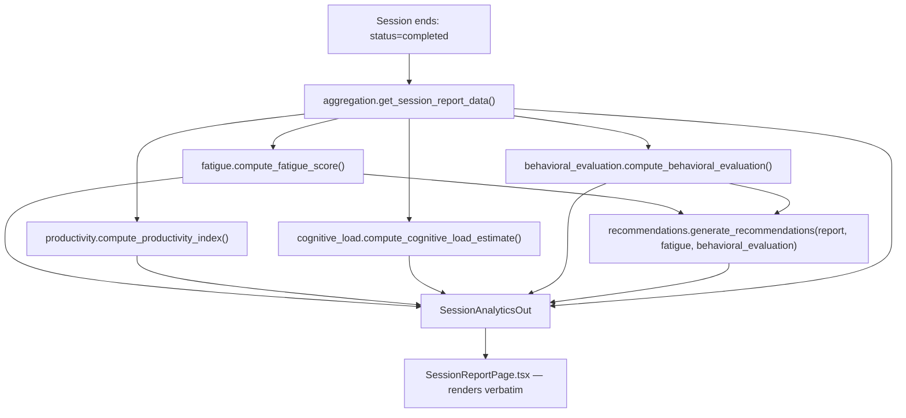

# Reporting and Recommendations

## Pipeline

`GET /sessions/{id}/report` (`app/api/sessions.py:get_session_report`) is gated on `Session.status == completed` (409 otherwise, not 403 — this is a state conflict, not an authorization failure; ownership is checked separately and returns 403/404).

## Separation of report content

| Category | Fields | Nature |
|---|---|---|
| **Quantitative results** | `report_data` (scores, times, error counts, `task_breakdown`), `productivity_index`, `cognitive_load_estimate`, `fatigue_score`, `behavioral_metrics`, `typing_metrics` | Deterministic |
| **Behavioral interpretation** | `behavioral_evaluation` (evolution metrics, observations, primary observation, confidence) | Deterministic |
| **Recommendations** | `recommendations` (9 rule-based checks) | Deterministic |
| **LLM-generated narrative** | — | **Not present.** See below. |

**The current final report contains no LLM-generated narrative content. Every field in `SessionAnalyticsOut` is produced by a deterministic Python function.** `generate_debrief`/`DebriefNarrative` (see `openai-integration.md`) is not called anywhere in the report-assembly path — confirmed by inspecting `get_session_report`'s full body, which contains no `openai`/`ai.*` import or call.

## The nine recommendation rules (`app/recommendations/engine.py`)

All are deterministic, rule-based, independently evaluated (a session can match more than one rule at once — this is not a first-match-wins cascade).

| # | Trigger | Recommendation title | `source_observation` |
|---|---|---|---|
| 1 | `error_trend_score ≥ 60` | Vérification sous pression | `"ERRORS_INCREASING"` when `behavioral_evaluation.errors.evolution == "INCREASING"`, else `None` |
| 2 | `slowdown_score ≥ 50` | Rythme de travail | `"PACE_SLOWING"` when matching, else `None` |
| 3 | declared-stress component `≥ 70` AND `fatigue_score < 40` | Écart entre pression ressentie et performance | `"STRESS_STABLE_PERFORMANCE"` when that signal fired, else `None` |
| 4 | `avg_score_overall < 50` AND `decline < 15` | Précision des réponses | Not tagged |
| 5 | `pause_count ≥ 3` | Gestion du rythme de tâches | Not tagged |
| 6 | `typing_speed_variation ≥ 3.0` | Rédaction de réponses écrites | Not tagged |
| 7 | `stress[-1] − stress[0] ≥ 1` | Évolution de la pression déclarée | `"STRESS_INCREASING"` when `behavioral_evaluation.stress.evolution == "INCREASING"`, else `None` |
| 8 | `fatigue_score < 25` AND `decline < 15` AND (`avg_score_overall ≥ 50` or `None`), requires ≥2 completed tasks | Rythme de travail soutenu | Not tagged |
| 9 | Fallback — only shown when no other rule fired | Données insuffisantes / Session équilibrée | Not tagged |

**4 of 9 rules (1, 2, 3, 7) currently carry a `source_observation` tag.** The remaining 5 have no defined 1:1 mapping to a behavioral-evaluation observation code — this is a partial, not exhaustive, traceability feature.

Recommendations are **purely deterministic/rule-based** — no LLM call exists anywhere in `recommendations/engine.py`.

## Report DTO location

`app/schemas/session_report.py` defines the full `SessionAnalyticsOut` contract, including the additive `behavioral_evaluation: Optional[BehavioralEvaluationOut]` field and the additive `source_observation` field on `RecommendationOut`. Both additions preserve the pre-existing DTO shape (no field removed or renamed).
