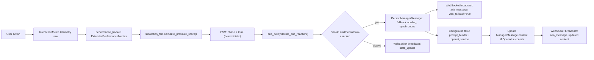

# Runtime Architecture

This document reconstructs the complete runtime flow from a user action to a persisted result, and the parallel ARIA supervision pipeline that runs alongside it. Both pipelines are traced directly from source; neither is inferred from design intent.

## Complete session flow

```mermaid
sequenceDiagram
    participant U as User
    participant FE as Frontend (CockpitPage)
    participant API as FastAPI
    participant DB as PostgreSQL
    participant ARIA as ARIA pipeline

    U->>FE: Login
    FE->>API: POST /auth/login
    API-->>FE: JWT

    FE->>API: POST /sessions/
    API->>DB: INSERT Session (task_sequence, position=0, max_duration_seconds=1800)
    API-->>FE: SessionOut

    loop for each of 6 tasks
        FE->>API: GET /sessions/{id}/next-task
        API->>DB: existing non-completed Task at position? (idempotent check)
        alt none exists
            API->>API: TaskEngine.generate_next_task()
            API->>DB: INSERT Task (sequence_index = position)
        end
        API->>ARIA: emit_aria_reaction("task_started")
        API-->>FE: SequencedTaskOut

        FE->>API: POST /tasks/{id}/engage (on first genuine interaction)
        API->>DB: SET started_at = now() (only if still null)

        Note over FE: participant works on the task

        FE->>API: POST /tasks/{id}/complete
        API->>API: score submission deterministically
        API->>DB: UPDATE Task (content_score, error_count, time_taken_seconds, status=completed)
        API->>DB: UPDATE Session (task_sequence_position += 1)
        API->>ARIA: emit_aria_reaction("task_completed")
    end

    FE->>API: GET /sessions/{id}/next-task
    API-->>FE: 409 (sequence complete; current_phase set to debriefing)

    FE->>API: POST /sessions/{id}/end
    API->>DB: UPDATE Session (status=completed, current_phase=debriefing)

    FE->>API: GET /sessions/{id}/report
    API->>API: aggregation → behavioral_evaluation → recommendations
    API-->>FE: SessionAnalyticsOut
```

## Stage-by-stage detail

| Stage | Endpoint / function | Notes |
|---|---|---|
| A. Login | `POST /auth/login` | Returns a JWT; no session-specific state yet |
| B. Session creation | `POST /sessions/` (`start_session`) | Stamps the default sequence and global duration once, at creation |
| C. Task retrieval | `GET /sessions/{id}/next-task` (`get_next_task`) | Backend-authoritative; idempotent; ignores any client-supplied task type once a sequence is active |
| D. Task engagement | `POST /tasks/{id}/engage` | The one write site for `Task.started_at`; idempotent; ownership-checked |
| E. Task execution | (client-side interaction) | No backend call until submission, aside from optional per-task telemetry writes (typing metrics, reconsideration count) |
| F. Task completion | `POST /tasks/{id}/complete` (`submit_task`) | Scores the submission, advances `task_sequence_position`, fires the `task_completed` ARIA event |
| G. Next task | loop back to stage C | — |
| H. Final task | same endpoint, position reaches sequence length | `current_phase` set to `debriefing` |
| I. Debriefing | any further `GET next-task` | Returns 409; no further tasks are assigned |
| J. Report generation | `GET /sessions/{id}/report` | Gated on `Session.status == completed` (set only by `POST /sessions/{id}/end`) |

## Parallel ARIA pipeline

Every task-started, task-completed, and stress-declared event routes through the same deterministic pipeline before any wording is generated:



## Independence of the two pipelines

**The analytical/reporting pipeline (layers 1–4, 7) and the ARIA pipeline (layer 5–6) share raw observations — the same `Task`, `InteractionMetric`, and `StressDeclaration` rows — but do not control one another.**

Verified:
- `backend/app/reports/behavioral_evaluation.py` imports nothing from `simulation_fsm.py`, `aria_policy.py`, or `manager_service.py`, and is only ever invoked from `get_session_report` — after the session has already ended.
- `simulation_fsm.py` and `aria_policy.py` import nothing from `app/reports/`.
- The only shared code is `performance_tracker.py`, which both sides read from independently; neither writes to it based on the other's output.

This means: a session's behavioral evaluation result can never change how ARIA behaved during that session (evaluation happens after the fact, at report time), and ARIA's tone/message history can never alter a productivity, fatigue, or behavioral-evaluation number (those are computed purely from `Task`/telemetry rows, never from `ManagerMessage` content).
