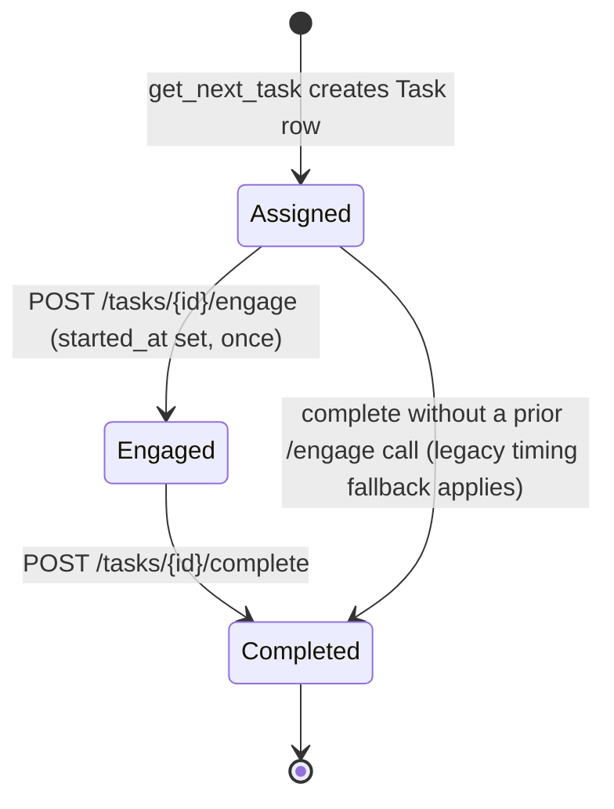

# Session and Task Engine

## Default task sequence

Verified from `backend/app/core/sequence_config.py`:

```python
DEFAULT_TASK_SEQUENCE = [
    "data_validation",
    "data_validation",
    "document_organization",
    "document_organization",
    "email_writing",
    "urgent_request",
]
DEFAULT_MAX_DURATION_SECONDS = 1800  # 30 minutes
```

This list is stamped onto `Session.task_sequence` exactly once, at session creation (`start_session`, `backend/app/api/sessions.py`). It is never modified afterward and never chosen or reordered by the frontend.

## Session-level sequencing fields

| Field | Type | Purpose |
|---|---|---|
| `Session.task_sequence` | JSON list of strings, nullable | The ordered list of `TaskType` values this session must produce. Nullable so a legacy/manual session (created before this feature, or with no sequence) falls back to unrestricted behavior rather than crashing. |
| `Session.task_sequence_position` | Integer, default 0 | Index into `task_sequence` of the currently active task. Advances by exactly 1 per genuine completion. |
| `Session.max_duration_seconds` | Integer, nullable | Global session time budget in seconds. `None` means no global limit is enforced. |
| `Task.sequence_index` | Integer, nullable | The position this specific task occupied when generated; `None` for task types outside the sequence (`email_prioritization`). |

## `get_next_task` decision logic (`backend/app/api/tasks.py`)

1. If `Session.task_sequence` is falsy → legacy path: generate via `TaskEngine` using the client-supplied `task_type` query parameter (unrestricted, pre-dates the sequential feature).
2. Otherwise:
   a. If `current_phase == debriefing` → 409 (simulation already ended).
   b. If the computed remaining global time (`max_duration_seconds - elapsed`) is ≤ 0 → set `current_phase = debriefing`, return 409.
   c. If `task_sequence_position >= len(task_sequence)` → set `current_phase = debriefing`, return 409.
   d. If a non-completed `Task` already exists at the current position → return that same row (idempotency; a page refresh must never generate a second task or advance state).
   e. Otherwise, derive `current_type = TaskType(task_sequence[position])`, generate via `TaskEngine`, stamp `Task.sequence_index = position`.

**Why the backend is authoritative**: at no point does the sequential branch read the client-supplied `task_type` — it is only consulted in the legacy (`task_sequence is None`) branch. A client sending `?task_type=urgent_request` while sequence position 0 expects `data_validation` receives `data_validation` regardless; this was verified with a live request.

## Completion and sequence advancement (`submit_task`)

- A task whose `status` is already `completed` is rejected with 400 — this is also what makes position-advancement exactly-once: the block that increments `task_sequence_position` sits inside the same function, guarded by the same check, so a duplicate/replayed completion request cannot execute it twice.
- A task whose `sequence_index` no longer matches the session's current `task_sequence_position` is rejected with 409 — this is the mechanism that prevents reopening or submitting a superseded task.
- On a genuine completion: `task_sequence_position = task.sequence_index + 1`; if that reaches `len(task_sequence)`, `current_phase` is set to `debriefing` in the same transaction.

## Task types outside the default sequence

| Task type | Status | Evidence |
|---|---|---|
| `email_prioritization` | **Implemented but not default** | Has its own complete backend (router, scenario/decision models, deterministic priority-evaluation scoring) and a working frontend component (`EmailPrioritizationTask.tsx`), but is never generated by `get_next_task` and is deliberately excluded from `DEFAULT_TASK_SEQUENCE`. |
| `image_matching` | **Backend-dormant / legacy** | Has a scorer (`app/tasks/image_matching.py`) and is registered in `TaskEngine.INSTANCE_GENERATORS`, and is reachable only through the legacy (`task_sequence is None`) `task_type=` query parameter path. No frontend component exists for it anywhere in the codebase. |
| `TaskStatus.expired` | **Dormant / legacy** (enum value, not a task type) | Defined in `app/models/enums.py`'s `TaskStatus` enum. Zero assignments anywhere in the backend or frontend — no code path ever transitions a `Task` into this status. Retained in the enum and database column without any code change, since removing it would require a schema migration for no functional gain; no destructive change is proposed. |

## Task timing model — two distinct timing bases

The implementation has **two separate timing concepts that must not be merged**:

### 1. `time_taken_seconds` (pre-existing, used by productivity/cognitive-load)

Computed at completion time in `submit_task`:
```python
reference_start = task.started_at or task.assigned_at
task.time_taken_seconds = int((now - reference_start).total_seconds())
```
Before the engagement feature existed, `started_at` was never set, so this always resolved to `assigned_at` — i.e., assignment-to-completion time. It still falls back to `assigned_at` for any task that never called `/engage`. **This field is unchanged** and remains what `productivity.py` and `cognitive_load.py` use for their time-efficiency components.

### 2. Active execution time (new, used only by the Behavioral Evaluation layer)

Computed in `app/reports/behavioral_evaluation.py:task_active_execution_seconds`:
```python
if task.started_at is not None and task.completed_at is not None:
    return (task.completed_at - task.started_at).total_seconds()
```
This is `None` — not a guess — when `started_at` was never set (legacy sessions, or a task that timed out before any interaction). In that case, `task_pace_efficiency` falls back to `time_taken_seconds`, explicitly flagged via `TaskPaceSample.is_legacy_fallback = True`, and this flag is never silently discarded.

### `assigned_at`, `started_at`, `completed_at`

| Field | Set when | Nullable |
|---|---|---|
| `assigned_at` | `Task` row creation (`TaskEngine.generate_next_task`) | No |
| `started_at` | `POST /tasks/{id}/engage`, on the first genuine interaction, **once** | Yes |
| `completed_at` | `POST /tasks/{id}/complete` | Yes until completion |

**`assignment_delay = started_at - assigned_at`** and **`active_execution_time = completed_at - started_at`** are two derived quantities computed on the fly by the Behavioral Evaluation layer; neither is a stored column.

### `/tasks/{id}/engage` — idempotency and security

```python
if task.started_at is None and task.status != TaskStatus.completed:
    task.started_at = datetime.utcnow()
    db.commit()
```
- **Idempotent**: a second call is a harmless no-op; `started_at` is never overwritten.
- **Ownership-checked**: routed through the same `get_owned_task` dependency as every other task endpoint — a 403 is returned for a task belonging to another user's session.
- **Frontend call sites**: each of the four default task components calls this exactly once, guarded by a `useRef` flag, on the participant's first meaningful interaction (a checkbox toggle for `data_validation`, a drag/drop classification for `document_organization`, a keystroke for `email_writing`, an option selection for `urgent_request`) — never on component mount or task fetch.

## Task lifecycle diagram


