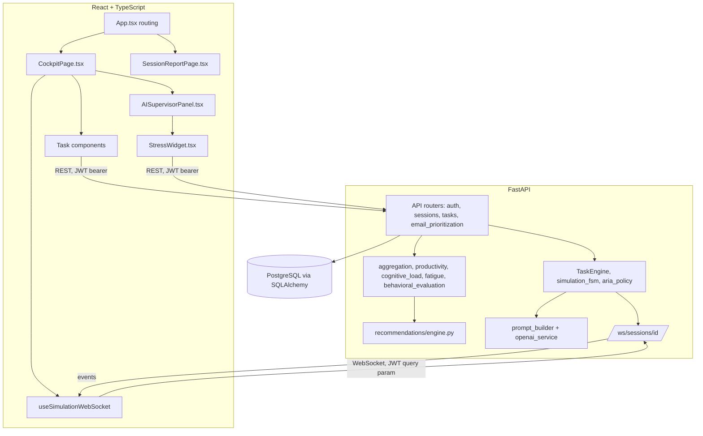

# System Architecture

## Overview

WorkPulse AI is a two-tier web application: a React/TypeScript single-page frontend and a FastAPI (Python) backend, backed by a PostgreSQL database. Real-time updates during a simulation are delivered over a single WebSocket channel per session. All natural-language generation for the AI supervisor ("ARIA") is delegated to a single, centralized OpenAI integration module.

## Frontend

- **Stack**: React 18, TypeScript, Vite, React Router.
- **Routing** (`frontend/src/App.tsx`): `/` (landing), `/login`, `/register`, `/settings`, `/tasks` (the simulation cockpit, no layout wrapper — the cockpit renders its own full-height chrome), and, under a shared `MainLayout`, `/bureau` (a separate dashboard view) and `/sessions/:id/report`.
- **Cockpit** (`features/simulation/CockpitPage.tsx`): fetches the backend-authoritative current task (`GET /sessions/{id}/next-task`), renders the matching task component, and displays a read-only sequence-progress sidebar. It never selects or reorders tasks itself.
- **Task components** (`features/simulation/components/`): `DataValidationTask.tsx`, `DocumentOrganizationTask.tsx`, `EmailWritingTask.tsx`, `UrgentRequestTask.tsx` — each is self-contained (owns its own countdown timer and submission logic) and receives a `{task, onCompleted}` prop pair. `EmailPrioritizationTask.tsx` exists and is fully functional but is not dispatched by the cockpit's default sequence (see `session-and-task-engine.md`).
- **ARIA panel** (`features/simulation/components/AISupervisorPanel.tsx`): renders the live message feed, a supervision-tone track, and telemetry tiles, sourced entirely from `GET /sessions/{id}/manager-messages`, `GET /sessions/{id}/performance-snapshot`, and the WebSocket channel.
- **Stress widget** (`features/stress/StressWidget.tsx`): a 1–5 self-report control, embedded inside the ARIA panel, posting to `POST /sessions/{id}/stress`.
- **Report interface** (`features/report/SessionReportPage.tsx` + `features/report/components/*.tsx`): renders the backend's `SessionAnalyticsOut` DTO verbatim; no client-side recomputation of scores, trends, or classifications.
- **WebSocket layer**: `hooks/useSimulationWebSocket.ts` owns connection lifecycle and exponential-backoff reconnection; `services/websocket/websocketTypes.ts` defines and structurally validates the four real event payload shapes.

A separate, real, routed feature (`features/dashboard/Dashboard.tsx`, at `/bureau`) exists as a distinct, self-contained view using its own mock in-memory session state (`AppContext.tsx`). It is reachable and not dead code, but it is architecturally independent of the backend-wired simulation cockpit described in this documentation set.

## Backend

- **Framework**: FastAPI, synchronous SQLAlchemy ORM sessions, one async boundary (`AsyncOpenAI`) isolated to the OpenAI integration.
- **API layer** (`app/api/`): `auth.py` (register/login/me), `sessions.py` (session lifecycle, stress declaration, report), `tasks.py` (sequential task retrieval/engagement/completion), `email_prioritization.py` (a fully separate router for the non-default `email_prioritization` task type).
- **Orchestration** (`app/orchestrators/`): `task_engine.py` (template selection and content-generation dispatch), `adaptation.py` (difficulty-pool and deadline adjustment rules), `simulation_fsm.py` (ARIA's phase/tone state machine), `aria_policy.py` (trigger decision and cooldown), `performance_tracker.py` (the shared metrics snapshot both ARIA and the report consume), `aria_pipeline.py` / `email_event_pipeline.py` (the two event-to-broadcast pipelines).
- **Task scorers** (`app/tasks/`): one module per task type, each a pure function comparing a submission against the task's own generated ground truth.
- **Analytics** (`app/reports/`): `aggregation.py` (session-level data assembly), `productivity.py`, `cognitive_load.py`, `fatigue.py`, and the additive `behavioral_evaluation.py`.
- **Recommendations** (`app/recommendations/engine.py`): nine deterministic, rule-based recommendation checks.
- **AI integration** (`app/ai/`): `openai_service.py` (the sole `AsyncOpenAI` access point), `prompt_builder.py` (bounded, structured prompt assembly), `task_generation.py` (controlled content generation for task instances).
- **WebSocket** (`app/main.py`, `app/ws/connection_manager.py`): a single endpoint, an in-memory, single-process connection registry keyed by session id.

## Database

- **Engine**: PostgreSQL (`app/database.py`, `DATABASE_URL` env var), accessed through SQLAlchemy's declarative ORM.
- **Core tables**: `users`, `sessions`, `tasks`, `manager_messages`, `interaction_metrics`, `stress_declarations`, `task_templates`, plus the `email_scenarios`/`email_task_items`/`email_decisions` tables supporting the non-default `email_prioritization` task type.
- **Dormant tables**: `performance_indicators`, `reports`, `recommendations` (the SQLAlchemy models `PerformanceIndicator`, `Report`, `Recommendation`) exist in the schema and are wired via ORM relationships to `Session`, but have zero application-code reads or writes anywhere in `app/api/`, `app/orchestrators/`, or `app/reports/`. The system computes report/analytics data dynamically on every request rather than persisting it to these tables. See `security-architecture.md` and `docs/methodology/limitations.md` for further discussion; no schema change is proposed here.

## Communication

- **REST**: JSON over HTTPS(-capable), JWT bearer authentication, used for all task/session/report operations.
- **WebSocket**: one connection per active session, authenticated via a `?token=` query parameter (browsers cannot set a custom header on the WebSocket handshake), used exclusively for real-time ARIA messages and simulation-state pushes. See `websocket-architecture.md`.

## Security (summary; full detail in `security-architecture.md`)

- JWT (HS256) issued at login, decoded on every protected REST call and on WebSocket connection.
- Per-request ownership checks (`get_owned_session` / `get_owned_task`) enforce that a user can only access their own sessions, tasks, and reports.
- The OpenAI API key is read only in backend configuration and never appears in any response body or WebSocket payload.

## Infrastructure

No Docker configuration, container orchestration, or deployment automation was found in the repository at the time of this audit. The backend runs via `uvicorn app.main:app`; the frontend is built via Vite (`npm run build`) and served as static assets. This documentation makes no claim about production deployment infrastructure beyond what is verifiable in the repository.
