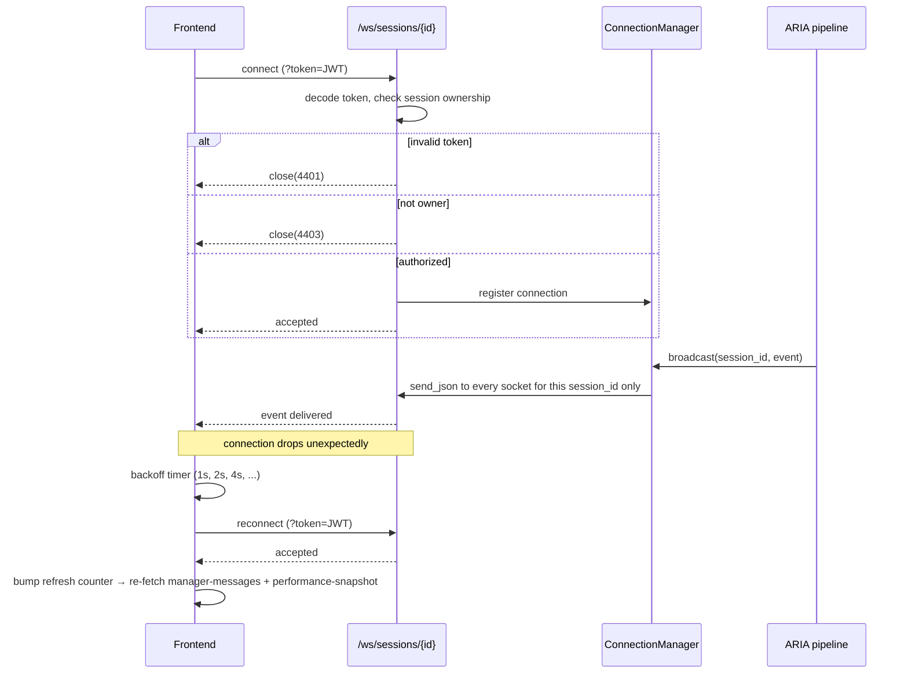

# WebSocket Architecture

## Endpoint

`@app.websocket("/ws/sessions/{session_id}")`, defined in `backend/app/main.py`.

## Authentication and ownership

- The JWT is passed as a `?token=` query parameter, since a browser `WebSocket` constructor cannot set a custom `Authorization` header.
- The token is decoded with the exact same `decode_access_token` function used by the REST `get_current_user` dependency.
- Before `accept()` is called: if the token is invalid, the connection is closed with code `4401`; if the session does not belong to the decoded user, it is closed with code `4403`. Ownership is therefore enforced **before** the connection is ever accepted.

## Connection management

`backend/app/ws/connection_manager.py` implements an in-memory registry: `Dict[session_id, List[WebSocket]]`, guarded by an `asyncio.Lock`. This is explicitly documented in the module's own docstring as a deliberate scope limit appropriate to the project's current single-process scale — not a horizontally-scalable pub/sub layer.

## Session isolation

`ConnectionManager.broadcast(session_id, payload)` only ever sends to the list of sockets registered under that exact `session_id`. There is no code path by which a broadcast for one session can reach a socket registered under a different one.

## Actual event types

Verified from both the backend broadcast call sites and the frontend's structural parser (`frontend/src/services/websocket/websocketTypes.ts`):

| Event `type` | Emitted by | Payload |
|---|---|---|
| `aria_analyzing` | `aria_pipeline.py` / `email_event_pipeline.py`, when a message is about to be generated | `{session_id, task_id?}` |
| `aria_message` | Same, twice per generated message: once synchronously with fallback content (`was_fallback: true`), once again if the background OpenAI call succeeds (`was_fallback: false`, same `id`) | `{id, session_id, task_id?, content, tone, trigger, sent_at, was_fallback, event_id}` |
| `state_update` | Same, on every telemetry event | `{session_id, task_id?, event_id, simulation: {phase, manager_state, pressure_score, communication_frequency_seconds}, performance?, state?}` |
| `stress_declared` | `sessions.py:declare_stress` | `{session_id, stress_level, timestamp, previous_stress_level, stress_change}` |

**No other event type exists.** The frontend's `parseSimulationEvent` function returns `null` (silently ignored) for any `type` it does not structurally recognize; there is no `aria_reminder` or `aria_task_assigned` event anywhere in the implementation.

## Reconnection strategy

`frontend/src/hooks/useSimulationWebSocket.ts` implements exponential backoff: `[1000, 2000, 4000, 8000, 16000, 30000]` milliseconds, one connection per `(sessionId, enabled)` pair. React's effect cleanup semantics guarantee the previous socket is closed before a new one opens.

## REST resynchronization after reconnect

When the connection status transitions from `reconnecting` to `connected`, `CockpitPage.tsx` bumps the same counter (`taskTransitionCounter`) that normally only advances on a real task change. This forces `useManagerMessages` and `useSessionTelemetry` to re-fetch `GET /sessions/{id}/manager-messages` and `GET /sessions/{id}/performance-snapshot`, closing the gap where a message broadcast during a connection outage would otherwise never reach the client. No new REST endpoint or WebSocket protocol change was introduced for this — it reuses the existing catch-up fetch both hooks already had for task transitions.

## Duplicate prevention

`useManagerMessages.appendOrUpdateMessage` **upserts by message `id`** rather than always appending. The backend reserves a `ManagerMessage` row with fallback content and broadcasts it immediately, then (if the OpenAI call succeeds) updates that same row's content and re-broadcasts with the identical `id` — the frontend renders this as one message whose text updates in place, never as two separate messages.

## Sequence diagram

## Single-process limitation

The connection registry lives in a single Python process's memory. Running multiple backend worker processes (e.g. multiple `uvicorn` workers, or horizontal scaling) would fragment the registry, and a broadcast triggered on one worker would not reach a client connected to another. This is a documented, current architectural limitation, not a defect — the project's current scale is a single development process.
